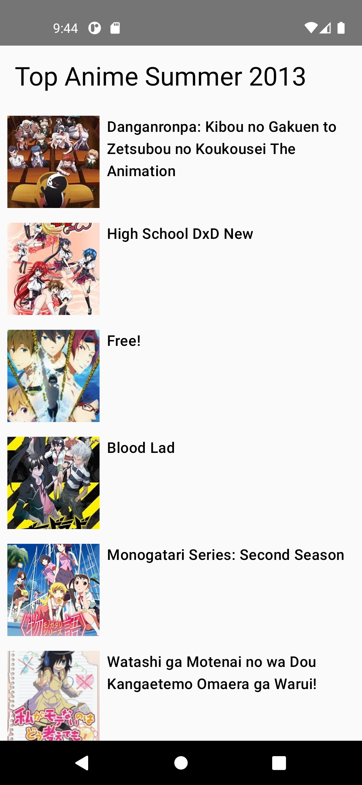
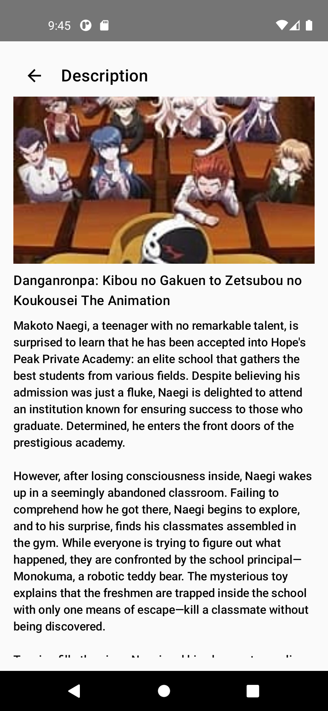

# LGB
LGB compose code

/*
README.md Overview:
- Description: MVVM Jetpack Compose Kotlin app demonstrating Clean Architecture
- Features: Modularization, Hilt, Coroutines, Flow, Unit Tests, Error Handling
- Modules: app, core, common
- Made Use of public API to display list and detail page
- How to Run: Clone, open in Android Studio, build and run
- Screenshots: [Attach screenshots of AnimeList and AnimeDetail screens here]
*/

